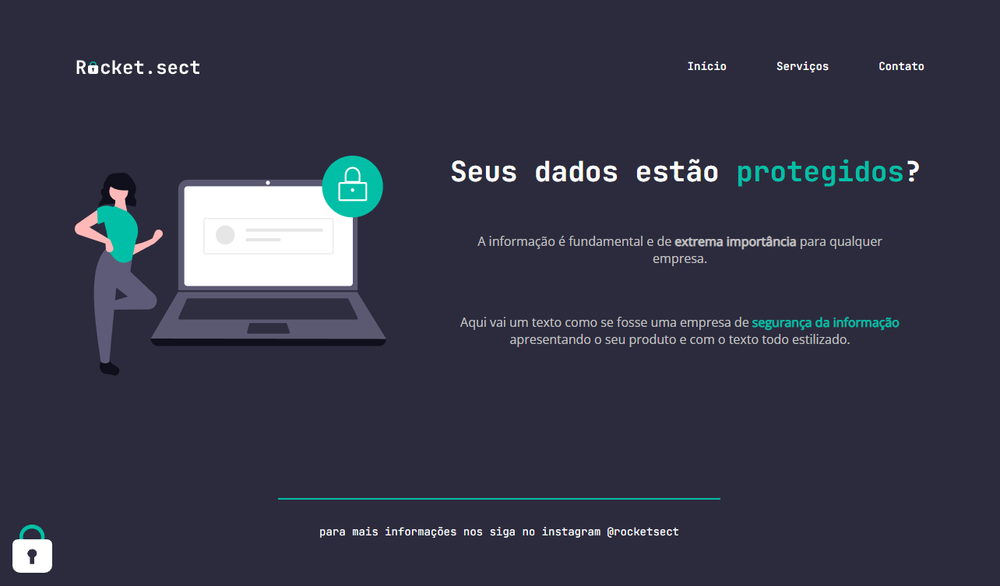

# 💻 Projeto: Rocket.sect

 

# 📌 Sobre o Projeto

Este projeto foi um desafio proposto do programa Explorer da Rocketseat, foi passado o Layout através do Figma para podermos desenvolver este Website. 

 

# 📌 Tecnologias 
Esse projeto foi desenvolvido com as seguintes tecnologias:

* HTML
* CSS

 
 

<h4 align="center">
    Por Rodrigo de Morais 🚀
</h4>